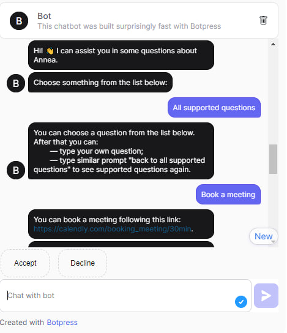

# Project 1: 
## [Sarcasm Detection](https://github.com/botvyns/sarcasm_detection_traditional_ML) in Ukrainian Language

This project explores sarcasm detection in the Ukrainian language using three traditional ML classifiers: Random Forest, Multinomial Naïve Bayes, and Decision Tree. 

### *Note*: 
There is an update on fine-tuning RoBERTa for sarcasm detection in Ukrainian, generation of synthetic sarcastic dataset with OpenAI and annotation of real sarcastic data with OpenAI. See [this repo](https://github.com/botvyns/bachelor_project).

# Project 2:
## [A signature extraction from email with LLM help](https://github.com/botvyns/llm_signature)

This project involves evaluating the performance of Mistral and Llama in extracting email signatures and structuring them into JSON format.

# Project 3:
## [Summarization of video content with LLM](https://github.com/botvyns/learning_how_to_learn)

Applying concepts from Learning How to Learn by Barbara Oakley with LLM assistance for educational video summarization.

# Project 4:
## [A conversational assistant powered by LangChain, OpenAI, and Streamlit](https://github.com/botvyns/assistant).

This assistant uses RAG. As a context, it has a web-page that tells a story of media that focuses on underground Ukrainian music. 
The project needs improvements, in terms of, for example, hallucinations.

# Project 5:
## A chatbot that provides support about a particuar company. 

It involves recognition of user intent and answers to them, handling of some fallbacks, flow design. This is rule based with automatic intent and some entities recognition.

